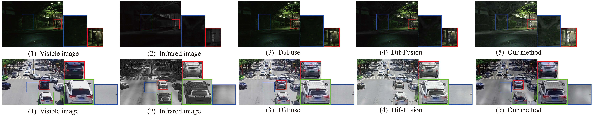
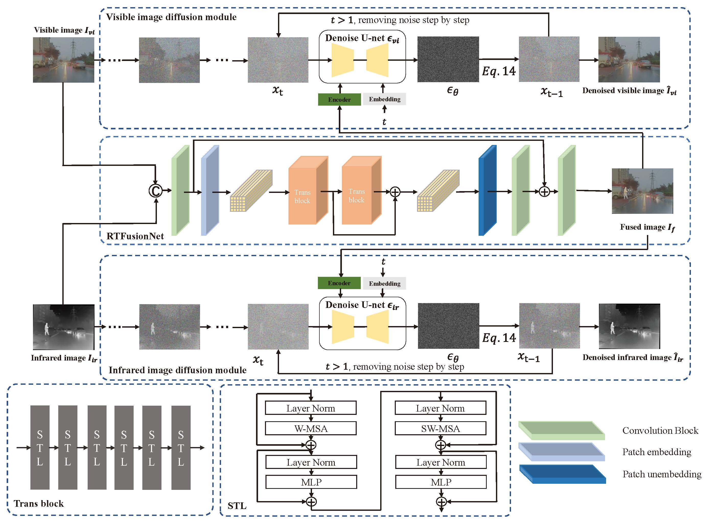

# DSFuse: A Dual-Diffusion Structure for Feature Fidelity Infrared and Visible Image Fusion

Zhijia Yang, Kun Gao^※^, Yanzheng Zhang, Xiaodian Zhang, Zibo Hu, Junwei Wang, Jingyi Wang, Li Wei


<p align="center">
  
</p>

This repository provides the official implementation of **DSFuse**, a novel dual-diffusion structure for infrared and visible image fusion. DSFuse leverages generative priors from diffusion models to address **conflicting modality information** and achieve **feature fidelity** in fused images. It combines a transformer-based fusion network (**RTFusionNet**) with dual **diffusion modules** for enhanced supervision and reconstruction feedback.

> 📝 Accepted by *IEEE Transactions on Neural Networks and Learning Systems (TNNLS), 2025*  
> 📄 Paper DOI: [10.1109/TNNLS.2025.3584834](https://ieeexplore.ieee.org/document/3584834)


<p align="center">
  
</p>

## ✨ Highlights

- 💡 **Dual-diffusion guidance**: Reconstructs source images from noise using diffusion models to supervise fusion fidelity.
- 🧠 **Transformer-based Fusion Network**: Uses Swin Transformer blocks to model global dependencies.
- 📷 **MSIV Dataset**: A new Multi-Scenary Infrared and Visible image dataset for training and evaluation.
- 🚀 **SOTA Performance**: Outperforms 11+ methods on 4 popular datasets in both quality and downstream tasks (detection, segmentation).
- ⚡️ **Efficient Inference**: Only uses the fusion network at inference time, reducing computation.

## 🗂️ Project Structure

```
DSFuse/
├── configs/              # Training/testing configurations
├── model/                # Fusion network and diffusion modules
├── dataset/              # Dataset loading scripts
├── losses/               # Loss functions (Fusion loss, DDPM loss)
├── scripts/              # Training, testing, visualization
├── utils/                # Utility functions
├── checkpoint/           # pretrained models
├── task/                 # train or inference code
└── README.md
```

## 📦 Installation

### Requirements

- Python ≥ 3.8
- PyTorch ≥ 1.10
- torchvision
- numpy, opencv-python, matplotlib, tqdm, einops

### Setup

```bash
git clone https://github.com/Yzhijia/DSFuse.git
cd DSFuse
pip install -r requirements.txt
```

## 🖼️ Dataset

We provide the **MSIV dataset**, which includes:

- 7000 aligned IR-VI image pairs
- Diverse scenes: streets, lakes, nature, urban
- Varied targets: people, cars, ships, UAVs
- Multiple conditions: day, night, rain

📥 [Download MSIV Dataset](https://github.com/Yzhijia/Multi-Scenary-Infrared-and-Visible-images-dataset)
📥 [Download MSIV Dataset for Detection](https://github.com/Yzhijia/Multi-Scenary-Infrared-and-Visible-images-dataset)
You can also use standard datasets:

- [LLVIP](https://github.com/bupt-ai-cz/LLVIP)
- [M3FD](https://github.com/JinyuanLiu-CV/TarDAL)
- [MSRS](https://github.com/Linfeng-Tang/MSRS)

Dataset structure:
```
data/
├── MSIV/
│   ├── train/
│   │   ├── ir/
│   │   └── vis/
│   └── test/
│       ├── ir/
│       └── vis/
```

## 🏁 Quick Start

### Training

```bash
CUDA_VISIBLE_DEVICES=0,1,2,3 python -m torch.distributed.launch --nproc_per_node=4 --master_port=1234 task/trainer_swin.py --fusion_loss_type SADLoss --fusion_model_type RTFusionNet --config configs/diff_fusion.yaml --exp_name RTFusionNet_SADLoss_nores --reset
```

### Evaluation

```bash
CUDA_VISIBLE_DEVICES=0,1,2,3 python -m torch.distributed.launch --nproc_per_node=1 --master_port=1234 task/trainer_swin.py --fusion_loss_type SADLoss --fusion_model_type RTFusionNet --config configs/diff_fusion.yaml --exp_name RTFusionNet_SADLoss_nores --infer
```


## 📊 Results

DSFuse achieves SOTA performance across 6 metrics on 4 datasets (LLVIP, MSRS, M3FD, MSIV):

| Method      | EN↑   | MI↑   | Qabf↑ | SF↑   | MS-SSIM↑ | VIF↑  |
|-------------|-------|-------|-------|-------|-----------|-------|
| FusionGAN   | 7.89  | 6.41  | 0.845 | 18.52 | 0.682     | 0.421 |
| TGFuse      | 8.23  | 6.79  | 0.867 | 20.02 | 0.693     | 0.438 |
| Dif-Fusion  | 8.40  | 6.91  | 0.870 | 21.21 | 0.699     | 0.457 |
| **DSFuse**  | **8.65** | **7.15** | **0.889** | **22.32** | **0.725** | **0.483** |

*↑: higher is better*

## 📚 Citation

```bibtex
@article{yang2025dsfuse,
  title={DSFuse: A Dual-Diffusion Structure for Feature Fidelity Infrared and Visible Image Fusion},
  author={Yang, Zhijia and Gao, Kun and Zhang, Yanzheng and Zhang, Xiaodian and Hu, Zibo and Wang, Junwei and Wang, Jingyi and Li, Wei},
  journal={IEEE Transactions on Neural Networks and Learning Systems},
  year={2025},
  doi={10.1109/TNNLS.2025.3584834}
}
```

## 📬 Contact

**Zhijia Yang**  
School of Optics and Photonics  
Beijing Institute of Technology  
📧 gaokun@bit.edu.cn

© 2025 Zhijia Yang et al. All Rights Reserved.